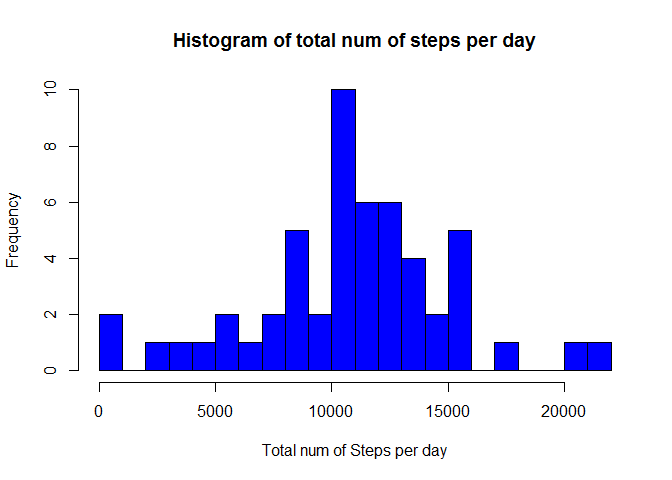
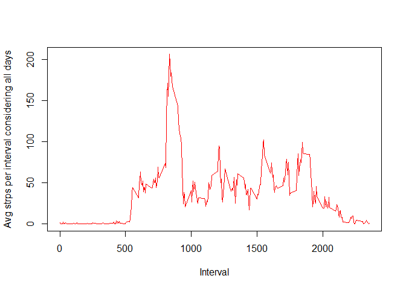
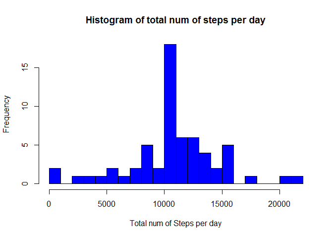
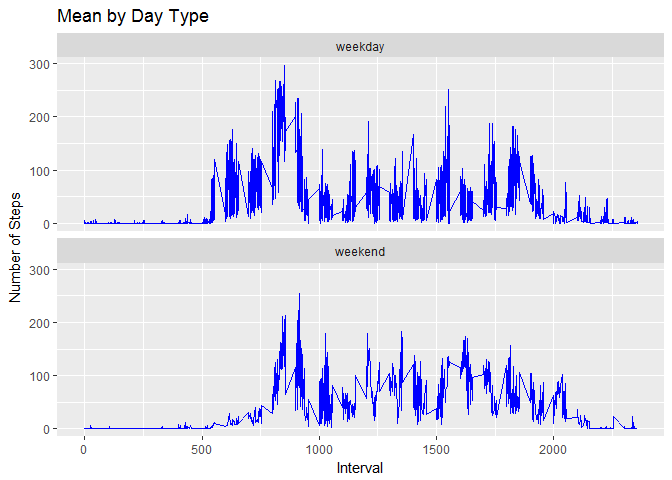

# Reproducible Research: Peer Assessment 1


## Loading the data


The data is stored in a csv file called "activity.csv". This file is saved in a zip file named: "repdata_data_activity.zip". The below code downloads & unzips this file and then reads the data from the csv file. 

```r
#Download the data
url <- "https://d396qusza40orc.cloudfront.net/repdata%2Fdata%2Factivity.zip"

file_name <- "activity.zip"

download.file(url, file_name)

# Unzip file
unzip (file_name)

#read data from the CSV file into data frame
activity <- read.csv("activity.csv", header = TRUE)
```

  

## What is mean total number of steps taken per day?

For this part of the assignment, you can ignore the missing values in the dataset.  

1.Calculate the total number of steps taken per day  


```r
require(dplyr)

Total_day_data <- activity %>% filter(is.na(steps) == FALSE) %>% group_by(date) %>% summarise(Total_day=sum(steps))

head(Total_day_data, 6)
```

```
## # A tibble: 6 × 2
##         date Total_day
##       <fctr>     <int>
## 1 2012-10-02       126
## 2 2012-10-03     11352
## 3 2012-10-04     12116
## 4 2012-10-05     13294
## 5 2012-10-06     15420
## 6 2012-10-07     11015
```


2. Make a histogram of the total number of steps taken each day

```r
histogram <- hist(Total_day_data$Total_day, breaks=20, xlab="Total num of Steps per day", main = "Histogram of total num of steps per day", col="blue")
```

<!-- -->


3.Calculate and report the mean and median of the total number of steps taken per day

```r
mean <- mean(Total_day_data$Total_day, na.rm = TRUE)
median <- median(Total_day_data$Total_day, na.rm = TRUE)

#Print the mean
mean
```

```
## [1] 10766.19
```

```r
#Print the median
median
```

```
## [1] 10765
```


## What is the average daily activity pattern?

1.Make a time series plot (i.e. type = "l") of the 5-minute interval (x-axis) and the average number of steps taken, averaged across all days (y-axis)  


```r
Avg_steps_interval <- activity %>%filter(!is.na(steps)) %>%group_by(interval) %>%summarize(steps = mean(steps))

plot(Avg_steps_interval$interval,Avg_steps_interval$steps,type = "l",col="red", xlab = "Interval",ylab="Avg strps per interval considering all days")
```

<!-- -->

2.Which 5-minute interval, on average across all the days in the dataset, contains the maximum number of steps?

```r
x <- max(Avg_steps_interval$steps)
Avg_steps_interval$interval[which(Avg_steps_interval$steps==x)]
```

```
## [1] 835
```

## Imputing missing values

1.Calculate and report the total number of missing values in the dataset (i.e. the total number of rows with NAs)  


```r
sum(is.na(activity$steps))
```

```
## [1] 2304
```


2+3.Devise a strategy for filling in all of the missing values in the dataset. The strategy does not need to be sophisticated. For example, you could use the mean/median for that day, or the mean for that 5-minute interval, etc.

**Let's fill the missing values with the mean for the respective 5-min intervals, by first creating a new data frame that is equal to the original**


```r
filled_data <- activity
filled_data <- left_join(filled_data,Avg_steps_interval, by="interval")
filled_data$steps.x <- ifelse(is.na(filled_data$steps.x), filled_data$steps.y, filled_data$steps.x)

#remove the extra column
filled_data$steps.y <- NULL

colnames(filled_data) <- c("steps","date","interval")

head(filled_data, 6)
```

```
##       steps       date interval
## 1 1.7169811 2012-10-01        0
## 2 0.3396226 2012-10-01        5
## 3 0.1320755 2012-10-01       10
## 4 0.1509434 2012-10-01       15
## 5 0.0754717 2012-10-01       20
## 6 2.0943396 2012-10-01       25
```

4.Make a histogram of the total number of steps taken each day and Calculate and report the mean and median total number of steps taken per day. Do these values differ from the estimates from the first part of the assignment? What is the impact of imputing missing data on the estimates of the total daily number of steps?


```r
filled_Total_day_data <- filled_data %>% group_by(date) %>% summarise(Total_day=sum(steps))

filled_Total_day_data$date <- as.character(filled_Total_day_data$date)

histogram <- hist(filled_Total_day_data$Total_day, breaks=20, xlab="Total num of Steps per day", main = "Histogram of total num of steps per day", col="blue")
```

<!-- -->


```r
mean <- mean(filled_Total_day_data$Total_day, na.rm = TRUE)
median <- median(filled_Total_day_data$Total_day, na.rm = TRUE)

#Print the mean
mean
```

```
## [1] 10766.19
```

```r
#Print the median
median
```

```
## [1] 10766.19
```


\color{red} We note the following \color{black}  

- Mean is the same as before(i.e: when computed before replacing missing values), the Median is different.

- The impact of imputing missing values:

1. Mean & Median now have the same value
2. Frequency (on the plot) has patially increased due to counting more values(i.e: the newly filled NA's) for some intervals.


## Are there differences in activity patterns between weekdays and weekends?

For this part the weekdays() function may be of some help here. Use the dataset with the filled-in missing values for this part.  

1.Create a new factor variable in the dataset with two levels – “weekday” and “weekend” indicating whether a given date is a weekday or weekend day.


```r
#use the weekdays() functions to find the days of the week and fill them in a new column call it "Day"
filled_data$Day <- weekdays(as.Date(filled_data$date))

#If day is between Monday & Friday call it: weekday, otherwise call it: weekend
filled_data$Day_type <- ifelse( (filled_data$Day=="Saturday"|filled_data$Day=="Sunday" ), "weekend","weekday")

#Convert into factor:
filled_data$Day_type <-as.factor(filled_data$Day_type)

head(filled_data,6)
```

```
##       steps       date interval    Day Day_type
## 1 1.7169811 2012-10-01        0 Monday  weekday
## 2 0.3396226 2012-10-01        5 Monday  weekday
## 3 0.1320755 2012-10-01       10 Monday  weekday
## 4 0.1509434 2012-10-01       15 Monday  weekday
## 5 0.0754717 2012-10-01       20 Monday  weekday
## 6 2.0943396 2012-10-01       25 Monday  weekday
```

2.Make a panel plot containing a time series plot (i.e. type = "l") of the 5-minute interval (x-axis) and the average number of steps taken, averaged across all weekday days or weekend days (y-axis).


**Note**  

We could also group by a 3rd variable which is the actual day of the week to get:


```r
library (ggplot2)
```

```
## Warning: package 'ggplot2' was built under R version 3.2.5
```

```r
data <- filled_data %>% group_by(Day_type,Day,interval) %>% summarise(Mean = mean(steps))
ggplot(data, aes(x= interval, y = Mean)) + geom_line(color = "blue") +
  facet_wrap(~Day_type, nrow =2, ncol = 1) + labs(title = "Mean by Day Type", 
       x = "Interval" , 
       y = "Number of Steps")  
```

<!-- -->
